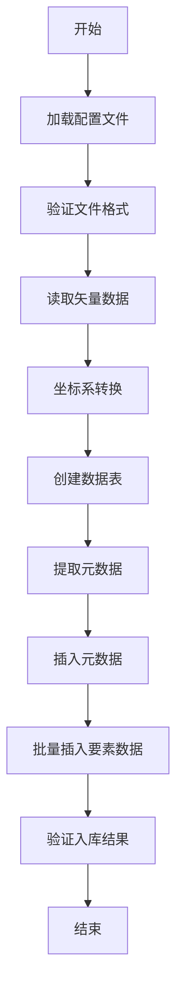

# 矢量数据入库PostGIS系统

## 项目概述

本项目是一个基于Python开发的矢量数据入库PostGIS工具，支持多种矢量格式（Shapefile、GeoJSON、KML、GML、CSV等）的数据入库，具备坐标系转换、批量处理、元数据管理等功能。

### 主要特性

- 🗺️ **多格式支持**：支持ESRI Shapefile、GeoJSON、KML、GML、CSV、GPKG、OpenFileGDB等格式
- 🔄 **坐标系转换**：支持多种坐标系之间的转换
- 📊 **元数据管理**：自动提取和管理数据元信息
- 🚀 **批量处理**：支持大批量数据的高效入库
- 📝 **日志记录**：完整的操作日志和错误追踪
- 🔗 **关联查询**：支持要素数据与元数据的关联查询

## 数据表结构设计

### 1. 矢量数据表 (vector_data)

存储实际的矢量要素数据，包含几何信息和属性数据。

```sql
CREATE TABLE vector_data (
    id SERIAL PRIMARY KEY,                    -- 主键ID
    geometry GEOMETRY(GEOMETRY, 4326),       -- 几何数据，WGS84坐标系
    properties JSONB,                         -- 属性数据，JSON格式
    metadata_id INTEGER,                      -- 关联元数据表的ID
    created_at TIMESTAMP DEFAULT CURRENT_TIMESTAMP,  -- 创建时间
    updated_at TIMESTAMP DEFAULT CURRENT_TIMESTAMP,  -- 更新时间
    
    -- 外键约束
    FOREIGN KEY (metadata_id) REFERENCES vector_metadata(id)
);

-- 索引
CREATE INDEX idx_vector_data_geometry ON vector_data USING GIST (geometry);
CREATE INDEX idx_vector_data_properties ON vector_data USING GIN (properties);
CREATE INDEX idx_vector_data_metadata_id ON vector_data (metadata_id);
```

**字段说明：**
- `geometry`: 存储几何数据，支持点、线、面、多点、多线、多面等类型
- `properties`: 存储要素属性，使用JSONB格式，支持复杂的数据结构
- `metadata_id`: 关联到元数据表，实现要素与文件信息的关联

### 2. 元数据表 (vector_metadata)

存储数据文件的元信息，用于管理和查询数据来源。

```sql
CREATE TABLE vector_metadata (
    id SERIAL PRIMARY KEY,                    -- 主键ID
    file_name VARCHAR(255),                   -- 文件名
    file_path TEXT,                           -- 文件路径
    file_size BIGINT,                         -- 文件大小（字节）
    file_format VARCHAR(50),                  -- 文件格式
    source_crs VARCHAR(100),                  -- 源坐标系
    target_crs VARCHAR(100),                  -- 目标坐标系
    feature_count INTEGER,                    -- 要素数量
    geometry_type VARCHAR(50),                -- 几何类型
    bbox_minx DOUBLE PRECISION,               -- 边界框最小X坐标
    bbox_miny DOUBLE PRECISION,               -- 边界框最小Y坐标
    bbox_maxx DOUBLE PRECISION,               -- 边界框最大X坐标
    bbox_maxy DOUBLE PRECISION,               -- 边界框最大Y坐标
    import_time TIMESTAMP DEFAULT CURRENT_TIMESTAMP,  -- 入库时间
    properties_schema JSONB,                  -- 属性字段结构
    additional_info JSONB                     -- 附加信息
);
```

**字段说明：**
- `properties_schema`: 存储属性字段的结构信息，如字段名、数据类型等
- `additional_info`: 存储其他元信息，如坐标系详情、内存使用情况、空值统计等

## 入库流程设计

### 1. 整体流程



### 2. 详细步骤

#### 步骤1：配置加载
- 读取 `config.json` 配置文件
- 建立数据库连接
- 设置日志记录

#### 步骤2：文件验证
- 检查文件是否存在
- 验证文件格式是否支持
- 获取文件基本信息

#### 步骤3：数据读取
- 根据文件格式选择相应的读取方式
- 使用 GeoPandas 读取矢量数据
- 处理编码问题

#### 步骤4：坐标系转换
- 检测源坐标系
- 执行坐标系转换（如需要）
- 验证转换结果

#### 步骤5：表结构创建
- 创建元数据表（如果不存在）
- 创建矢量数据表（如果不存在）
- 建立外键关联
- 创建必要的索引

#### 步骤6：元数据提取
- 提取文件基本信息
- 计算边界框
- 分析属性结构
- 统计要素信息

#### 步骤7：数据入库
- 插入元数据记录
- 获取元数据ID
- 批量插入要素数据
- 建立要素与元数据的关联

#### 步骤8：结果验证
- 检查插入记录数
- 验证数据完整性
- 输出入库统计信息

## 入库工具开发

### 1. 核心类设计

#### VectorToPostGIS 类

主要的工具类，负责整个入库流程的管理。

```python
class VectorToPostGIS:
    def __init__(self, config: Dict[str, Any]):
        """初始化工具类"""
        
    def setup_logging(self):
        """设置日志记录"""
        
    def setup_database_connection(self):
        """建立数据库连接"""
        
    def read_vector_data(self, file_path: str, encoding: str = 'utf-8') -> gpd.GeoDataFrame:
        """读取矢量数据"""
        
    def transform_coordinate_system(self, gdf: gpd.GeoDataFrame, 
                                  source_crs: str, target_crs: str) -> gpd.GeoDataFrame:
        """坐标系转换"""
        
    def create_tables(self, vector_table: str, metadata_table: str):
        """创建数据表"""
        
    def extract_metadata(self, gdf: gpd.GeoDataFrame, file_path: str, 
                        source_crs: str, target_crs: str) -> Dict[str, Any]:
        """提取元数据"""
        
    def insert_data(self, gdf: gpd.GeoDataFrame, vector_table: str, 
                   metadata: Dict[str, Any], metadata_table: str,
                   batch_size: int = 1000):
        """插入数据"""
        
    def process_vector_data(self, file_path: str, source_crs: str, target_crs: str,
                          vector_table: str, metadata_table: str, 
                          encoding: str = 'utf-8', batch_size: int = 1000):
        """处理矢量数据入库的主流程"""
```

### 2. 配置文件设计

#### config.json 结构

```json
{
  "database": {
    "host": "localhost",
    "port": 5432,
    "database": "gis_db",
    "username": "postgres",
    "password": "your_password"
  },
  "tables": {
    "vector_table": "vector_data",
    "metadata_table": "vector_metadata"
  },
  "processing": {
    "batch_size": 1000,
    "encoding": "utf-8"
  },
  "logging": {
    "level": "INFO",
    "directory": "logs"
  },
  "supported_formats": [
    "ESRI Shapefile",
    "GeoJSON",
    "KML",
    "GML",
    "CSV",
    "GPKG",
    "OpenFileGDB"
  ]
}
```

### 3. 依赖包管理

#### requirements.txt

```
geopandas>=0.12.0
pandas>=1.5.0
sqlalchemy>=1.4.0
psycopg2-binary>=2.9.0
fiona>=1.8.0
shapely>=1.8.0
pyproj>=3.4.0
numpy>=1.21.0
```

## 使用指南

### 1. 环境准备

```bash
# 安装依赖
pip install -r requirements.txt

# 配置数据库连接
# 编辑 config.json 文件，设置数据库连接信息
```

### 2. 基本使用

#### 命令行方式

```bash
python vector_to_postgis.py \
    --file_path data.shp \
    --source_crs EPSG:4326 \
    --target_crs EPSG:4326 \
    --db_host localhost \
    --db_port 5432 \
    --db_name gis_db \
    --db_user postgres \
    --db_password your_password
```

#### 编程方式

```python
from vector_to_postgis import VectorToPostGIS
import json

# 加载配置
with open('config.json', 'r') as f:
    config = json.load(f)

# 创建工具实例
tool = VectorToPostGIS(config)

# 处理数据入库
tool.process_vector_data(
    file_path='data.shp',
    source_crs='EPSG:4326',
    target_crs='EPSG:4326',
    vector_table='my_vector_data',
    metadata_table='my_metadata'
)
```

### 3. 测试脚本

使用提供的测试脚本进行快速验证：

```bash
python test_import_12222.py
```

## 数据查询示例

### 1. 通过元数据查询要素

```sql
-- 查询某个文件的所有要素
SELECT * FROM vector_data 
WHERE metadata_id = (
    SELECT id FROM vector_metadata 
    WHERE file_name = 'data.shp'
);
```

### 2. 通过要素查询元数据

```sql
-- 查询某个要素对应的元数据
SELECT m.* FROM vector_metadata m
JOIN vector_data d ON m.id = d.metadata_id
WHERE d.id = 123;
```

### 3. 空间查询

```sql
-- 查询指定范围内的要素
SELECT * FROM vector_data 
WHERE ST_Intersects(geometry, ST_GeomFromText('POLYGON((...))', 4326));
```

### 4. 属性查询

```sql
-- 查询特定属性的要素
SELECT * FROM vector_data 
WHERE properties->>'name' = '特定名称';
```

## 性能优化

### 1. 批量处理

- 使用批量插入提高性能
- 默认批量大小为1000条记录
- 可根据数据量调整批量大小

### 2. 索引优化

- 空间索引：提高空间查询性能
- JSONB索引：提高属性查询性能
- 外键索引：提高关联查询性能

### 3. 内存管理

- 分批读取大文件
- 及时释放内存
- 监控内存使用情况

## 错误处理

### 1. 常见错误及解决方案

#### 文件格式不支持
- 检查文件格式是否在支持列表中
- 确认文件完整性

#### 坐标系转换失败
- 检查坐标系定义是否正确
- 确认源坐标系信息

#### 数据库连接失败
- 检查数据库配置
- 确认网络连接

#### 权限不足
- 检查数据库用户权限
- 确认表创建权限

### 2. 日志记录

- 所有操作都有详细日志记录
- 错误信息包含完整的堆栈跟踪
- 支持不同级别的日志输出

## 扩展开发

### 1. 添加新格式支持

在 `read_vector_data` 方法中添加新的格式处理逻辑：

```python
if file_ext == '.new_format':
    # 添加新格式的读取逻辑
    pass
```

### 2. 自定义坐标系转换

扩展 `transform_coordinate_system` 方法，添加自定义转换逻辑。

### 3. 添加数据验证

在入库前添加数据质量检查：

```python
def validate_data(self, gdf: gpd.GeoDataFrame) -> bool:
    """数据验证"""
    # 添加验证逻辑
    pass
```

## 版本历史

- **v1.0.0** - 初始版本，支持基本矢量数据入库功能
- **v1.1.0** - 添加元数据管理和关联查询功能
- **v1.2.0** - 优化性能和错误处理

## 贡献指南

欢迎提交Issue和Pull Request来改进这个项目。

## 许可证

本项目采用MIT许可证。
