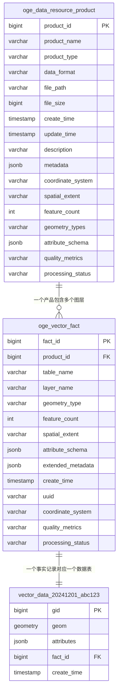
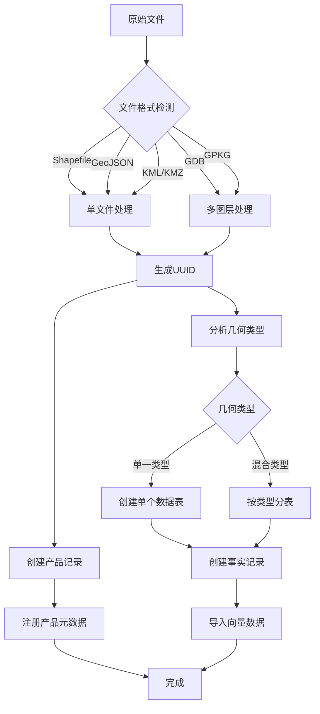
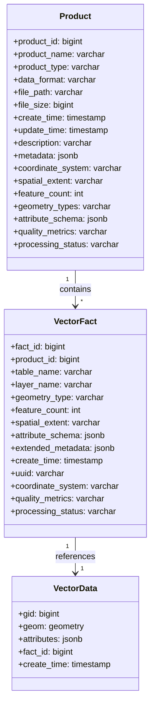
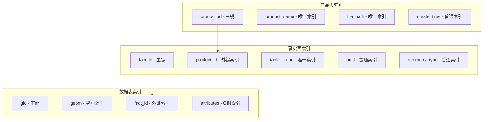
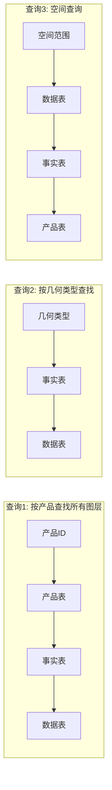

# 向量数据导入系统 - 实体关系图

## 核心表关系图

```mermaid
erDiagram
    %% 产品元数据表
    oge_data_resource_product {
        bigint product_id PK
        varchar product_name
        varchar product_type
        varchar data_format
        varchar file_path
        bigint file_size
        timestamp create_time
        timestamp update_time
        varchar description
        jsonb metadata
        varchar coordinate_system
        varchar spatial_extent
        int feature_count
        varchar geometry_types
        jsonb attribute_schema
        varchar quality_metrics
        varchar processing_status
    }

    %% 向量数据事实表
    oge_vector_fact {
        bigint fact_id PK
        bigint product_id FK
        varchar table_name
        varchar layer_name
        varchar geometry_type
        int feature_count
        varchar spatial_extent
        jsonb attribute_schema
        jsonb extended_metadata
        timestamp create_time
        varchar uuid
        varchar coordinate_system
        varchar quality_metrics
        varchar processing_status
    }

    %% 动态向量数据表 (示例)
    vector_data_20241201_abc123 {
        bigint gid PK
        geometry geom
        jsonb attributes
        bigint fact_id FK
        timestamp create_time
    }

    %% 关系定义
    oge_data_resource_product ||--o{ oge_vector_fact : "一个产品包含多个图层"
    oge_vector_fact ||--|| vector_data_20241201_abc123 : "一个事实记录对应一个数据表"
```

## 数据流向图

```mermaid
flowchart TD
    A[原始文件] --> B{文件格式检测}
    
    B -->|Shapefile| C[单文件处理]
    B -->|GeoJSON| C
    B -->|KML/KMZ| C
    B -->|GDB| D[多图层处理]
    B -->|GPKG| D
    
    C --> E[生成UUID]
    D --> E
    
    E --> F[创建产品记录]
    E --> G[分析几何类型]
    
    G --> H{几何类型}
    H -->|单一类型| I[创建单个数据表]
    H -->|混合类型| J[按类型分表]
    
    I --> K[创建事实记录]
    J --> K
    
    F --> L[注册产品元数据]
    K --> M[导入向量数据]
    
    L --> N[完成]
    M --> N
```

## 表结构详细图

```mermaid
classDiagram
    class Product {
        +product_id: bigint
        +product_name: varchar
        +product_type: varchar
        +data_format: varchar
        +file_path: varchar
        +file_size: bigint
        +create_time: timestamp
        +update_time: timestamp
        +description: varchar
        +metadata: jsonb
        +coordinate_system: varchar
        +spatial_extent: varchar
        +feature_count: int
        +geometry_types: varchar
        +attribute_schema: jsonb
        +quality_metrics: varchar
        +processing_status: varchar
    }
    
    class VectorFact {
        +fact_id: bigint
        +product_id: bigint
        +table_name: varchar
        +layer_name: varchar
        +geometry_type: varchar
        +feature_count: int
        +spatial_extent: varchar
        +attribute_schema: jsonb
        +extended_metadata: jsonb
        +create_time: timestamp
        +uuid: varchar
        +coordinate_system: varchar
        +quality_metrics: varchar
        +processing_status: varchar
    }
    
    class VectorData {
        +gid: bigint
        +geom: geometry
        +attributes: jsonb
        +fact_id: bigint
        +create_time: timestamp
    }
    
    Product "1" --> "*" VectorFact : contains
    VectorFact "1" --> "1" VectorData : references
```

## 索引和约束图

```mermaid
graph TD
    subgraph "产品表索引"
        A1[product_id - 主键]
        A2[product_name - 唯一索引]
        A3[file_path - 唯一索引]
        A4[create_time - 普通索引]
    end
    
    subgraph "事实表索引"
        B1[fact_id - 主键]
        B2[product_id - 外键索引]
        B3[table_name - 唯一索引]
        B4[uuid - 普通索引]
        B5[geometry_type - 普通索引]
    end
    
    subgraph "数据表索引"
        C1[gid - 主键]
        C2[geom - 空间索引]
        C3[fact_id - 外键索引]
        C4[attributes - GIN索引]
    end
    
    A1 --> B2
    B1 --> C3
```

## 查询关系示例

```mermaid
graph LR
    subgraph "查询1: 按产品查找所有图层"
        Q1[产品ID] --> P1[产品表]
        P1 --> F1[事实表]
        F1 --> D1[数据表]
    end
    
    subgraph "查询2: 按几何类型查找"
        Q2[几何类型] --> F2[事实表]
        F2 --> D2[数据表]
    end
    
    subgraph "查询3: 空间查询"
        Q3[空间范围] --> D3[数据表]
        D3 --> F3[事实表]
        F3 --> P3[产品表]
    end
``` 